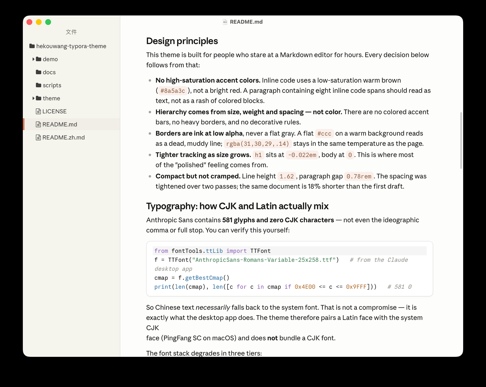
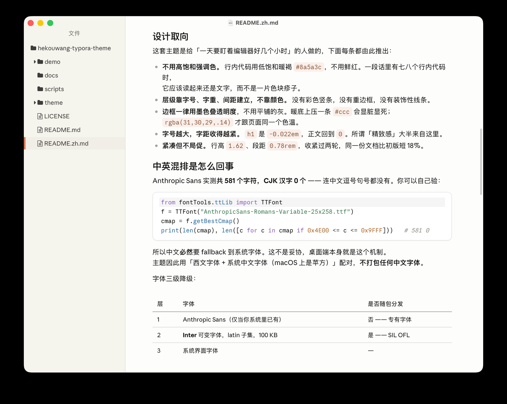

# hekouwang

A Typora theme that reproduces the reading experience of Claude's desktop app.

Built from a token file rather than hand-written CSS: every color, size and spacing value
lives in [`scripts/tokens.json`](scripts/tokens.json), and [`scripts/build.py`](scripts/build.py)
generates the stylesheet from it.



*Real Typora window — sidebar, file tree and editor pane are all themed.*



*Mixed CJK/Latin body text. Latin runs in Anthropic Sans (or Inter), Chinese in the system face.*

*[中文说明](README.zh.md)*

---

## Design principles

This theme is built for people who stare at a Markdown editor for hours. Every decision below
follows from that:

- **No high-saturation accent colors.** Inline code uses a low-saturation warm brown
  (`#8a5a3c`), not a bright red. A paragraph containing eight inline code spans should read as
  text, not as a rash of colored blocks.
- **Hierarchy comes from size, weight and spacing — not color.** There are no colored accent
  bars, no heavy borders, and no decorative rules.
- **Borders are ink at low alpha**, never a flat gray. A flat `#ccc` on a warm background reads
  as a dead, muddy line; `rgba(31,30,29,.14)` stays in the same temperature as the page.
- **Tighter tracking as size grows.** `h1` sits at `-0.022em`, body at `0`. This is where most
  of the "polished" feeling comes from.
- **Compact but not cramped.** Line height `1.62`, paragraph gap `0.78rem`. The spacing was
  tightened over two passes; the same document is 18% shorter than the first draft.

## Typography: how CJK and Latin actually mix

Anthropic Sans contains **581 glyphs and zero CJK characters** — not even the ideographic
comma or full stop. You can verify this yourself:

```python
from fontTools.ttLib import TTFont
f = TTFont("AnthropicSans-Romans-Variable-25x258.ttf")   # from the Claude desktop app
cmap = f.getBestCmap()
print(len(cmap), len([c for c in cmap if 0x4E00 <= c <= 0x9FFF]))   # 581 0
```

So Chinese text *necessarily* falls back to the system font. That is not a compromise — it is
exactly what the desktop app does. The theme therefore pairs a Latin face with the system CJK
face (PingFang SC on macOS) and does **not** bundle a CJK font.

The font stack degrades in three tiers:

| Tier | Font | Shipped? |
|---|---|---|
| 1 | Anthropic Sans (only if already installed on your system) | No — proprietary |
| 2 | **Inter** variable, Latin subset, 100 KB | Yes — SIL OFL |
| 3 | System UI font | n/a |

Tier 2 is what almost everyone will see, and it is what the screenshots are checked against.

## Install

```bash
git clone https://github.com/huiyonghkw/hekouwang-typora-theme.git
cd hekouwang-typora-theme
./scripts/install.sh
```

Or manually: copy `theme/hekouwang.css` and the `theme/hekouwang/` folder into your Typora
themes folder (Preferences → Open Theme Folder).

Then **quit Typora completely (Cmd+Q) and relaunch** — switching themes does not reload a
modified CSS file. Pick **Hekouwang** from the Themes menu.

## Customizing

Do not edit the CSS; it is generated. Edit `scripts/tokens.json` and rebuild:

```bash
python3 scripts/build.py      # → theme/hekouwang.css
./scripts/install.sh
```

The build refuses to emit CSS that violates two Typora rules, so a bad edit fails loudly
instead of silently breaking the editor:

- **zero `!important`** — specificity via `#write` is sufficient; the base stylesheet doesn't
  use `!important` either
- **zero `px` font sizes except the root** — Typora's font-size preference stops working
  otherwise

## How this differs from the existing "Claude Theme"

There is an [existing Claude Theme](https://theme.typora.io/theme/Claude-Theme/) in the
gallery with a similar goal. This is an independent implementation, not a fork — no CSS was
copied. The measurements below are reproducible from both repositories:

| | Existing Claude Theme | hekouwang |
|---|---|---|
| Authoring | 3,158 hand-written lines | generated from a token file |
| `!important` declarations | 397 | **0** (enforced at build time) |
| Font sizes | some `px` | all `rem` except root (per Typora spec) |
| Bundled fonts | ~24 MB (incl. full Noto Serif SC variable) | **100 KB** (Inter, Latin subset) |
| Anthropic fonts | bundled and redistributed | **not bundled**; `local()` detection + Inter fallback |
| Body CJK | Noto Serif SC (serif) | system sans-serif |
| Latin weights | single 400 → synthetic bold | true variable **300–800** + `opsz` axis |
| Page background | `#faf9f5` | `#fdfdfc` |
| UI coverage | mainly the editor pane | sidebar, file tree, outline, search panel, focus mode |

Two of these deserve an explanation:

**Body CJK.** The existing theme sets `#write { font-family: var(--font-serif) }`, which
renders Chinese in Noto Serif SC — a serif. The desktop app renders Chinese in the system
sans-serif (it has no choice; see the glyph coverage above). Matching the app means *not*
bundling a CJK serif.

**Page background.** `#faf9f5` is Anthropic's cream — but it is the *window/sidebar* color.
Sampling the desktop app's conversation pane gives `#fdfdfc`. This theme uses `#fdfdfc` for
the editor pane and `#f5f4ed` for the sidebar, preserving the app's two-level relationship.
(I originally used `#faf9f5` too, and only found the error by sampling a screenshot.)

## Fonts and licensing

This repository **does not contain, bundle or redistribute any Anthropic font.** Anthropic
Sans and Anthropic Serif are proprietary to Anthropic PBC and carry no open license.

The theme references them via `local()` and a local folder, so if they already exist on your
system they are used; otherwise the bundled Inter (SIL OFL 1.1, see
[`OFL.txt`](theme/hekouwang/fonts/OFL.txt)) is used and the theme looks complete.

`scripts/install.sh` accepts an opt-in `--use-local-anthropic` flag which copies those fonts
from an installed Claude desktop app into your own theme folder. It is **off by default**.
It moves files that already exist on your machine, for your personal use; do not redistribute
them. If you are unsure, don't use the flag — the Inter fallback is the intended default.

## Status

- Light theme: complete
- Dark theme: not yet — it will be sampled from the desktop app's dark mode rather than guessed
- Designed and tested on **macOS**. It should work on Windows/Linux, but is untested there, and
  it does not include styles for the Windows "unibody" layout.

## License

MIT for the CSS and scripts — see [LICENSE](LICENSE).
Inter is under SIL OFL 1.1.

This theme is an independent work inspired by the reading experience of Claude's desktop
application. It is not affiliated with, endorsed by, or sponsored by Anthropic PBC.
"Claude" and "Anthropic" are trademarks of Anthropic PBC.
