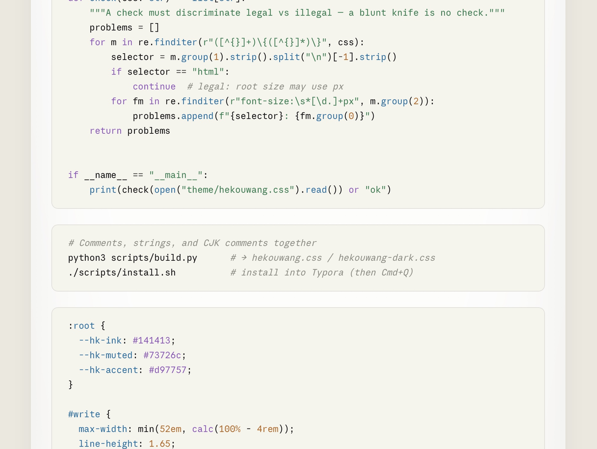

# hekouwang

**Live site:** [huiyonghkw.github.io/hekouwang-typora-theme](https://huiyonghkw.github.io/hekouwang-typora-theme/)

A Typora theme for people who write long-form Markdown in Chinese for hours.

Skins map to **hekouwang-content-skill V1–V6**. Shared reading metrics: body `1rem`, leading `1.65`, measure `min(52em, 100% − gutter)`, paper card on `#write`.

| Tier | Themes menu | What you get |
|---|---|---|
| **Free · MIT** | **Hekouwang** / **Hekouwang Dark** | Skill **V2 editorial** (warm paper). Gallery entry. Public repo ships this tier only. |
| **Paid · ¥9.9** | **Hekouwang V1…V6** (+ Dark each) | Skill matrix skins (tech / finance / glass / violet / flame + shared V2). **Palettes & craft stay off the public tree** — zip delivery only. |

**Buy:** landing-page [#buy](https://huiyonghkw.github.io/hekouwang-typora-theme/#buy) (WeChat Pay / Alipay · WeChat `hekouwang`, note `Typora主题`) → zip via WeChat → follow [#unlock](https://huiyonghkw.github.io/hekouwang-typora-theme/#unlock).

Free colors: [`scripts/palettes.json`](scripts/palettes.json). Paid palettes stay off the public tree. Metrics: [`scripts/tokens.json`](scripts/tokens.json). Rebuild free: `python3 scripts/build.py`.

*[中文说明](README.zh.md)*

---

## Free tier · real Typora (V2 editorial)

What the public repo / Gallery ships: **Hekouwang** / **Hekouwang Dark**. Same reading metrics, warm paper.


*Free V2 · `demo/验收样张.md`.*


*Free V2 · `demo/acceptance-sample.md`.*



*Free V2 · consecutive fences.*


*Free V2 · sidebar + paper editor.*

---

## Paid pack · real Typora (V1 / V3–V6)

Same metrics as free (`1rem` · `1.65` · `52em` · paper). Skins follow **hekouwang-content-skill**. V2 is the free pair (not repeated here).

| Skill | Tell-apart | Light | Dark |
|---|---|---|---|
| **V1 tech** | cool teal–violet | [V1.png](docs/V1.png) | [V1-Dark.png](docs/V1-Dark.png) |
| **V3 finance** | Material blue | [V3.png](docs/V3.png) | [V3-Dark.jpeg](docs/V3-Dark.jpeg) |
| **V4 glass** | mist white / near-black | [V4.png](docs/V4.png) | [V4-Dark.png](docs/V4-Dark.png) |
| **V5 violet HUD** | **violet × teal** | [V5.png](docs/V5.png) | [V5-Dark.jpeg](docs/V5-Dark.jpeg) |
| **V6 flame** | **violet × orange × pink** | [V6.png](docs/V6.png) | [V6-Dark.jpeg](docs/V6-Dark.jpeg) |

### V1 tech


### V3 finance


### V4 glass


### V5 violet HUD (violet × teal)

Links / quote edge / H2 rule use **teal** — not the flame oranges.


### V6 flame (violet × orange × pink)

H1 flare gradient; links in orange. Easy to tell from V5’s teal HUD.


---

## Design principles

- **Built for CJK long-form, not chat bubbles.** Chinese paragraphs need leading `≥1.6` and a measure near ~40–50 characters — not conversation-pane density.
- **No high-saturation accents.** Inline code uses warm brown (`#8a5a3c`) on a soft wash, so a line with many `` `code` `` spans still reads as text.
- **Hierarchy from size, weight, and spacing — not color bars.** No left accent stripes, no heavy chrome borders.
- **Borders are ink at low alpha**, never flat gray on a warm page.
- **Paper card on `#write`** (light and dark): warm radial, large radius, outer shadow; chrome (sidebar / gutter / titlebar) sits one step behind the paper.
- **PDF export is one canvas + refined blocks.** Page background matches the gutter (light `#ebe8df` / dark = body ground)—never a pure-white `#write` column on a tinted page. Export craft (shared by all V1–V6 light/dark skins): H2 signature line, lifted fences, rounded tables, gradient rules. No left accent bars.
- **Larger type, slightly tighter tracking.** CJK titles stay milder than Latin display tracking.

### PDF export

Typora PDF = standalone HTML (`body.typora-export`) then Electron `printToPDF`. This theme:

1. **Flattens the editor paper card** for export (no floating radius/shadow; `@page` matches the canvas).
2. **Refines blocks**: H2 brand signature underline, fences lifted slightly above the canvas, rounded tables with soft header + zebra, mid-fade HR.

After any CSS change: **Cmd+Q and relaunch**—switching themes does not reload modified CSS.

| Skin | Light canvas | Dark canvas |
|---|---|---|
| Free V2 | `#ebe8df` | `#1f1f1e` |
| Paid V1 / V3–V6 | each skin’s gutter | each skin’s body ground |


*Light · `demo/验收样张.md` — beige canvas, paper reading surface, no white column on a tinted page.*

### Reading metrics

| Token | Value | Why |
|---|---|---|
| `body_size` | `1rem` | Comfortable for multi-hour writing |
| `body_lh` | `1.65` | CJK density needs more leading than Latin UI copy |
| `measure` | `52em` | Fluid: `min(52em, calc(100% − gutter))` |
| `para_gap` | `0.78rem` | Compact without stacking into a wall |

---

## Typography: how CJK and Latin mix

Anthropic Sans has **581 glyphs and zero CJK characters** — not even ideographic punctuation. Chinese always falls back to the system face (PingFang SC on macOS). The theme pairs a Latin face with that system CJK face and **does not ship a CJK font**.

| Tier | Font | Shipped? |
|---|---|---|
| 1 | Anthropic Sans (if already on your machine) | No — proprietary |
| 2 | **Inter** variable, Latin subset, ~100 KB | Yes — SIL OFL |
| 3 | System UI font | n/a |

Most people see tier 2; screenshots are checked against that.

## Install (free V2)

```bash
git clone https://github.com/huiyonghkw/hekouwang-typora-theme.git
cd hekouwang-typora-theme
./scripts/install.sh
```

Or copy `theme/hekouwang.css`, `theme/hekouwang-dark.css`, and the `theme/hekouwang/` folder into Typora’s themes directory (Preferences → Open Theme Folder).

Then **quit Typora completely (Cmd+Q) and relaunch** — switching themes does not reload a modified CSS file. Choose **Hekouwang** or **Hekouwang Dark**.

### Paid pack (V1 / V3–V6)

Payment and delivery live only on the landing page: [#buy](https://huiyonghkw.github.io/hekouwang-typora-theme/#buy).

After you receive the zip:

```bash
./scripts/unlock.sh ~/Downloads/hekouwang-typora-theme-pack-YYYYMMDD.zip
# or, inside the unzipped pack: ./unlock.sh
```

## Customizing

Do not edit the CSS; it is generated. Edit `scripts/tokens.json` and rebuild:

```bash
python3 scripts/build.py          # public tree: free tier only by default
# → theme/hekouwang.css
# → theme/hekouwang-dark.css
./scripts/install.sh
```

The `dark` block overrides only `color` / `alpha`. Derived borders and washes come from `border_base` / `shadow_base`.

Build checks:

- **zero `!important`**
- **zero `px` font sizes except the root**
- paper metrics present on both light and dark work CSS

## How this differs from the gallery “Claude Theme”

There is an [existing Claude Theme](https://theme.typora.io/theme/Claude-Theme/) with a similar inspiration. This is an independent implementation — no CSS was copied.

| | Gallery Claude Theme | hekouwang |
|---|---|---|
| Authoring | ~3,158 hand-written lines | generated from tokens |
| `!important` | 397 | **0** (build-enforced) |
| Font sizes | some `px` | all `rem` except root |
| Bundled fonts | ~24 MB (incl. full Noto Serif SC) | **~100 KB** (Inter Latin) |
| Anthropic fonts | redistributed | **not shipped**; `local()` + Inter |
| Body CJK | Noto Serif SC | system sans-serif |
| Latin weights | single 400 → synthetic bold | variable **300–800** + `opsz` |
| UI coverage | mainly the editor | sidebar, tree, outline, search, focus |

**CJK.** Matching a desktop app that has no CJK glyphs means *not* bundling a serif CJK face.

**Backgrounds.** Cream `#faf9f5` is often the *window* color; the editor pane samples closer to `#fdfdfc`, with a slightly deeper chrome behind the paper card.

## Fonts and licensing

This repository **does not contain or redistribute any Anthropic font.** Anthropic Sans / Serif are proprietary.

`scripts/install.sh --use-local-anthropic` can copy those fonts from an installed Claude desktop app into *your* theme folder for personal use. **Off by default.** Do not redistribute copies. Inter is the intended default.

## Status

- Light + dark: complete
- Dark colors: **sampled**, not inverted from light
- Designed and tested on **macOS** (Windows / Linux untested; no Windows unibody styles yet)

## Theme engineering skill

This repo ships the maintenance skill **in-tree** under [`skills/`](skills/) (not a separate skill repo). Clone or open the project and agents that load project skills can use it directly — token-driven CSS, screenshot color sampling, font-on-screen checks.

**Canonical entry:**

- [`skills/hekouwang-typora-theme/SKILL.md`](skills/hekouwang-typora-theme/SKILL.md)

`.claude/skills/` and `.cursor/skills/` are symlinks to that folder so Claude Code / Cursor discover it automatically. No extra skill install step after clone.

## License

- **Free V2** (`hekouwang.css` / Dark) and scripts: MIT — [LICENSE](LICENSE). Inter is SIL OFL 1.1.
- **Paid pack**: personal use — [LICENSE-PRO.txt](LICENSE-PRO.txt); do not redistribute.

Independent work inspired by a calm desktop reading surface. Not affiliated with Anthropic PBC. “Claude” and “Anthropic” are trademarks of Anthropic PBC.
