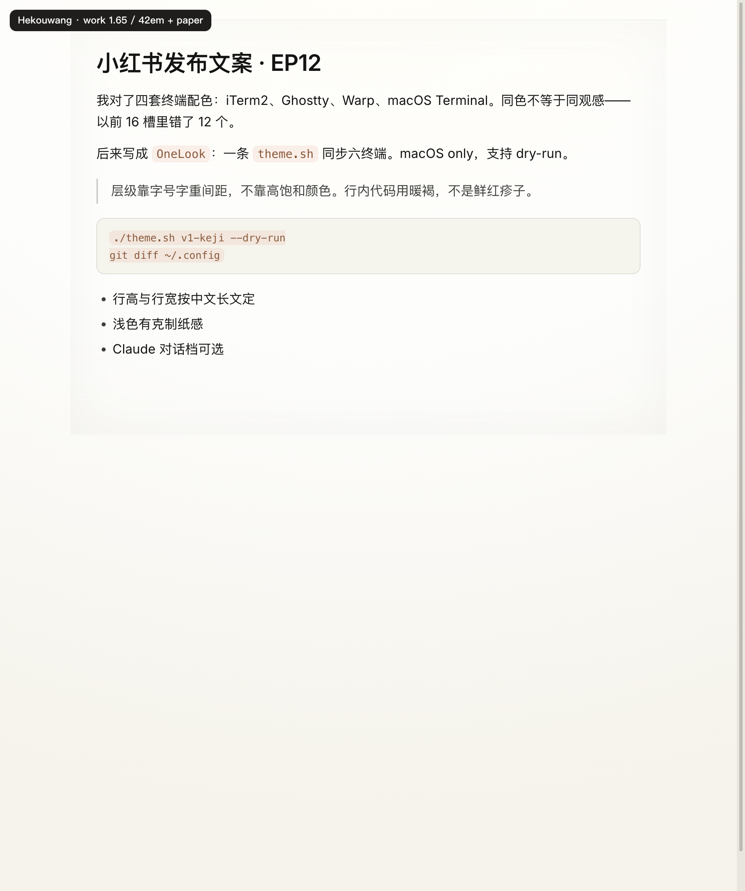
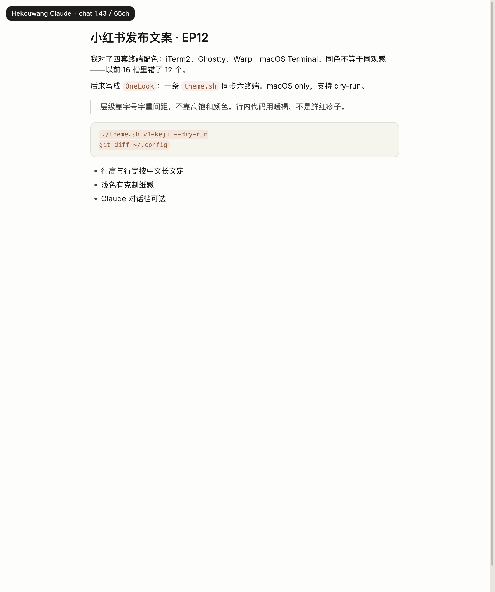
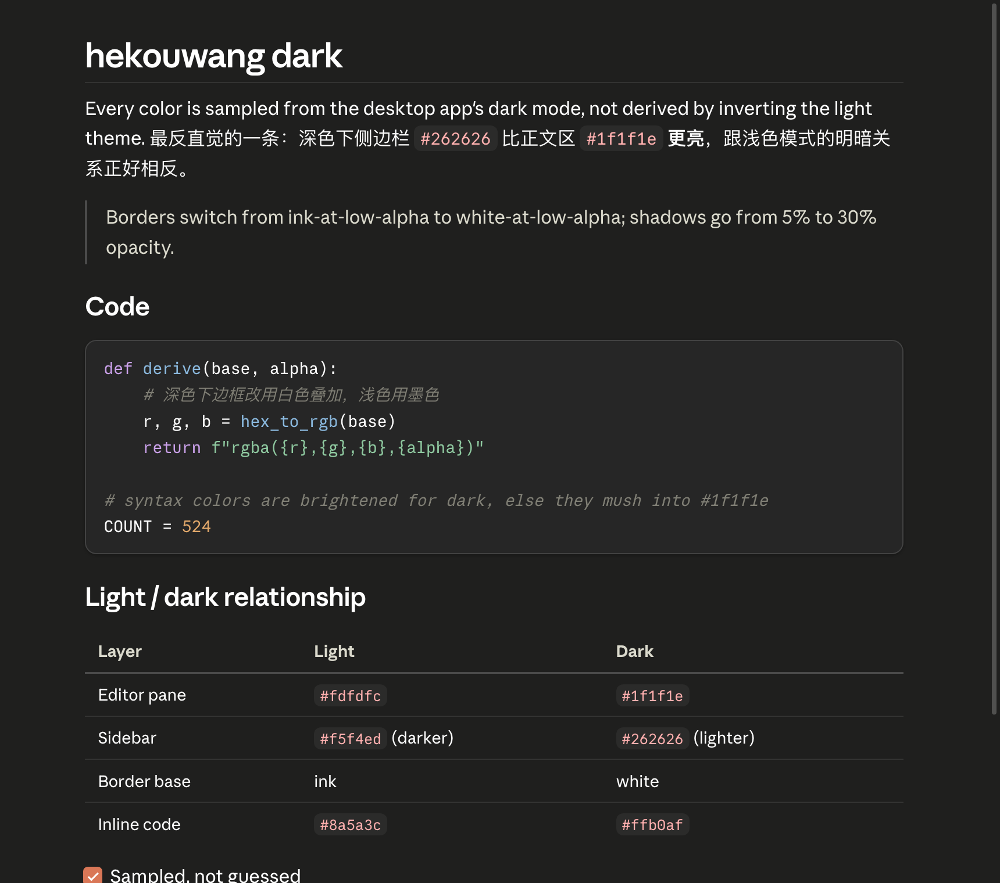

# hekouwang

给「一天要盯着 Markdown 好几个小时」的人用的 Typora 主题——**默认按中文长文来排**，不是按聊天气泡来排。

| 主题菜单名 | 档位 | 正文 | 行高 | 行宽 | 纸感 |
|---|---|---|---|---|---|
| **Hekouwang**（默认） | `work` 中文长文 | `1rem` | `1.65` | `42em`（约 40–42 字） | 浅色开 |
| **Hekouwang Claude**（可选） | `claude_read` 对话栏 | `0.875rem` | `1.42857` | `65ch` | 关 |

CSS 不是手写的，而是由 [`scripts/tokens.json`](scripts/tokens.json) 生成 —— 所有颜色、字号、间距都在那一个文件里，
改视觉只改它，跑 [`scripts/build.py`](scripts/build.py) 一次出四套（work/claude × 浅/深）。


*真实 Typora 窗口 —— 侧边栏、文件树、编辑区都在主题覆盖范围内。*
*（改排版 token 后请 Cmd+Q 重开再截；仓库里的窗口截图需随版本更新。）*

| work 默认 | Claude 对话档（可选） |
|---|---|
|  |  |

*上表是 `#write` 排版对照预览（Chrome）。行高 / 行宽 / 纸感差异应一眼可辨；**不能替代** Typora 真窗验收。*


*中英混排：西文走 Anthropic Sans（或 Inter），中文走系统字体。*



*深色版。全部色值采样自桌面端深色模式 —— 包括最反直觉的一条：深色下侧边栏比正文区**更亮**，
跟浅色模式的关系正好相反。*

*[English](README.md)*

---

## 设计取向

- **默认服务中文长文，Claude 对话档是可选项。** 对话行高 ≈1.43 适合短回复；汉字密、方块字，长文需要 ≥1.6 的行高和大约 40 字的行宽。两套指标拆开，才不会互相拖累。
- **不用高饱和强调色。** 行内代码用低饱和暖褐 `#8a5a3c`，不用鲜红。一段话里有七八个行内代码时，它应该读起来还是文字，而不是一片色块疹子。
- **层级靠字号、字重、间距建立，不靠颜色。** 没有彩色竖条，没有重边框，没有装饰性线条。
- **边框一律用墨色叠透明度**，不用平铺的灰。暖底上压一条 `#ccc` 会显脏显死；`rgba(31,30,29,.14)` 才跟页面同一个色温。
- **浅色 work 档有克制纸感。** 暖白径向 + 大圆角外阴影（卡片纸面），深色 **Hekouwang Dark** 同步同结构（gutter 用更亮的 `#262626`）。噪点默认关。
- **字号越大，字距略收。** 中文长标题比西文 display 收得更克制，避免挤成一团。

## 中英混排是怎么回事

Anthropic Sans 实测**共 581 个字符，CJK 汉字 0 个** —— 连中文逗号句号都没有。你可以自己验：

```python
from fontTools.ttLib import TTFont
f = TTFont("AnthropicSans-Romans-Variable-25x258.ttf")
cmap = f.getBestCmap()
print(len(cmap), len([c for c in cmap if 0x4E00 <= c <= 0x9FFF]))   # 581 0
```

所以中文**必然**要 fallback 到系统字体。这不是妥协，桌面端本身就是这个机制。
主题因此用「西文字体 + 系统中文字体（macOS 上是苹方）」配对，**不打包任何中文字体**。

字体三级降级：

| 层 | 字体 | 是否随包分发 |
|---|---|---|
| 1 | Anthropic Sans（仅当你系统里已有） | 否 —— 专有字体 |
| 2 | **Inter** 可变字体，latin 子集，100 KB | 是 —— SIL OFL |
| 3 | 系统界面字体 | — |

绝大多数人看到的是第 2 层，截图也是按第 2 层校对的。

## 安装

```bash
git clone https://github.com/huiyonghkw/hekouwang-typora-theme.git
cd hekouwang-typora-theme
./scripts/install.sh
```

或手动：把 `theme/hekouwang.css`、`hekouwang-dark.css`、`hekouwang-claude.css`、
`hekouwang-claude-dark.css` 和 `theme/hekouwang/` 目录复制进 Typora 主题文件夹
（偏好设置 → 打开主题文件夹）。

然后 **完全退出 Typora（Cmd+Q）再重开** —— 切换主题并不会重新加载被修改过的 CSS 文件。
在「主题」菜单里选 **Hekouwang**（默认长文）或 **Hekouwang Claude**（对话栏观感）。

## 定制

别改 CSS，它是生成物。改 `scripts/tokens.json` 后重新构建：

```bash
python3 scripts/build.py
# → hekouwang.css / hekouwang-dark.css
# → hekouwang-claude.css / hekouwang-claude-dark.css
./scripts/install.sh
```

阅读档在 `_presets.work` 与 `_presets.claude_read`；`dark` 段只覆盖 `color` / `alpha`，
派生值由 `border_base` / `shadow_base` 算出。

构建脚本会拒绝违反 Typora 规范的 CSS，并断言 work / claude 输出真的不同（行高、行宽、纸感）：

- **零 `!important`**
- **除根字号外零 `px` 字号**

## 与现有 "Claude Theme" 的差异

Gallery 里已有一套 [Claude Theme](https://theme.typora.io/theme/Claude-Theme/) 目标相近。
本主题是**独立实现，不是 fork**，没有复制任何 CSS。下面的数字两边仓库都可复现：

| | 现有 Claude Theme | hekouwang |
|---|---|---|
| 写法 | 手写 3158 行 | 由 token 文件生成 |
| `!important` | 397 处 | **0 处**（构建时强制） |
| 字号单位 | 部分用 `px` | 除根字号外全 `rem`（符合 Typora 规范） |
| 打包字体 | ~24 MB（含全量 Noto Serif SC 可变字体） | **100 KB**（Inter latin 子集） |
| Anthropic 字体 | 打包并再分发 | **不打包**；`local()` 探测 + Inter 兜底 |
| 正文中文 | Noto Serif SC（宋体） | 系统无衬线 |
| 西文字重 | 单一 400，粗体是合成的 | 真可变 **300–800** + `opsz` 光学尺寸轴 |
| 页面背景 | `#faf9f5` | `#fdfdfc`（work 浅色另加纸感） |
| 阅读档 | 一套观感 | **work 默认** + **claude 可选** |
| 界面覆盖 | 主要是编辑区 | 侧边栏、文件树、大纲、搜索面板、专注模式 |

其中两条值得解释：

**正文中文。** 现有主题设了 `#write { font-family: var(--font-serif) }`，中文落到 Noto Serif SC，
渲染成宋体。而桌面端的中文是系统无衬线（它没得选，见上面的字符覆盖）。要贴近桌面端，
正确做法恰恰是**不打包**中文衬线字体。

**页面背景。** `#faf9f5` 确实是 Anthropic 的米色，但那是**窗口/侧边栏**的颜色。
对桌面端对话区采样得到的是 `#fdfdfc`。本主题用 `#fdfdfc` 做编辑区、`#f5f4ed` 做侧边栏，
保留了桌面端的两级关系。（我最初也用的 `#faf9f5`，是采样截图才发现搞反了。）

## 字体与授权

本仓库**不包含、不打包、不再分发任何 Anthropic 字体**。Anthropic Sans / Serif 是 Anthropic PBC
的专有资产，没有任何开源授权声明。

主题通过 `local()` 和一个本地目录引用它们：你系统里有就用，没有就用随包分发的 Inter
（SIL OFL 1.1，见 [`OFL.txt`](theme/hekouwang/fonts/OFL.txt)），显示同样完整。

`scripts/install.sh` 有一个 `--use-local-anthropic` 开关，会把这些字体从你已安装的 Claude 桌面端
复制到你自己的主题目录。它**默认关闭**。它搬的是你机器上已经存在的文件，仅供你个人使用，
请不要再分发。拿不准就别开 —— Inter 兜底才是默认预期效果。

## 状态

- 浅色 / 深色 × work / claude：完成
- 深色色值：**采样**自桌面端深色模式，不是把浅色版取反
- 在 **macOS** 上设计与测试。理论上支持 Windows/Linux 但未经测试，也未包含 Windows "unibody" 布局的样式

## 爆款图文可用的钩子（产品叙事）

后续做介绍帖时，优先用这些**可截图、可对照**的矛盾，不要堆功能列表：

1. **「最像 Claude 的主题，默认却不该照抄 Claude 的对话行高」** —— work vs claude 同文档前后对比
2. **Gallery Claude Theme：397 个 `!important` / 24MB 宋体 vs 本主题 0 / 100KB** —— 工程对比卡
3. **深色侧栏比正文更亮** —— 反直觉采样卡（别人取反必做错）
4. **Anthropic Sans 0 个汉字** —— 中英混排真相卡

## 主题工程 Skill

维护本主题的 Claude Code / Cursor skill **就在本仓库内**（token 驱动生成、
从参照截图采样配色、带 fallback 基准的字体上屏验证）：

- [`.claude/skills/hekouwang-typora-theme/SKILL.md`](.claude/skills/hekouwang-typora-theme/SKILL.md)
- Cursor 通过 [`.cursor/skills/hekouwang-typora-theme/`](.cursor/skills/hekouwang-typora-theme/) 加载同一份

## 授权

CSS 与脚本采用 MIT，见 [LICENSE](LICENSE)。Inter 采用 SIL OFL 1.1。

本主题是受 Claude 桌面端阅读体验启发的独立作品，与 Anthropic PBC 无从属、认可或赞助关系。
"Claude" 与 "Anthropic" 是 Anthropic PBC 的商标。
