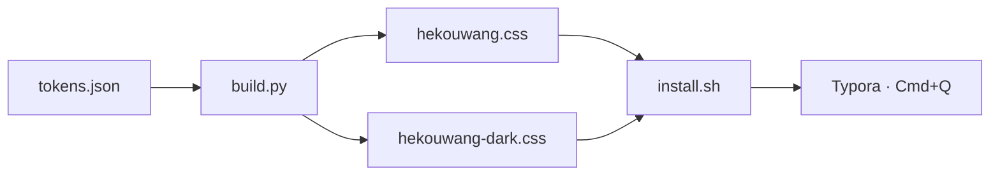
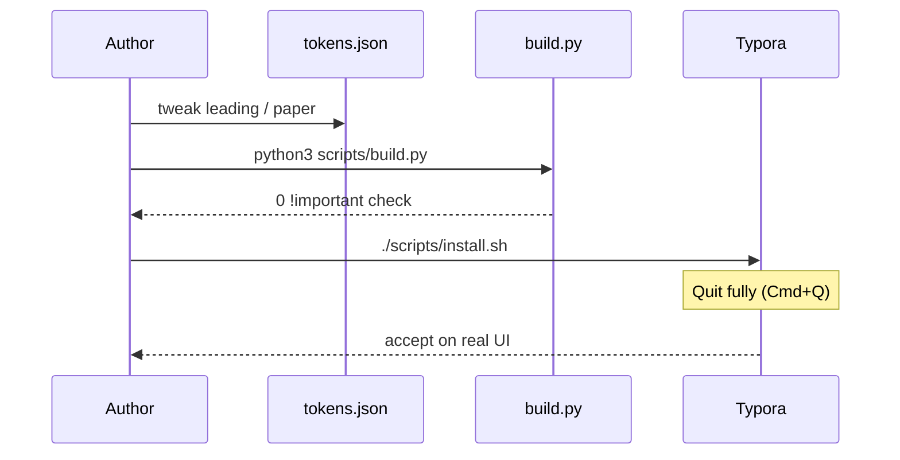
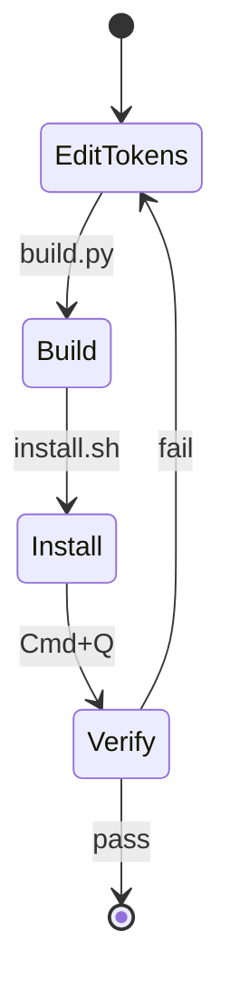

# hekouwang theme — acceptance sample

> — For QA and README screenshots (one light, one dark)

This file packs the Markdown blocks Typora usually renders. Mixed Latin + CJK is the point: Latin runs in Anthropic Sans / Inter; Chinese falls back to PingFang SC — **not a compromise; that is how the desktop app works**. I keep this file open and stare at light and dark for a few minutes each when I sign off a change.

**Current reading metrics (Hekouwang):** body `1rem` · leading `1.65` · measure `min(52em, 100%−gutter)` · paper card on `#write`.

---

## 1. Body & mixed script

I wrote this paragraph to check long-form breathing. Side-by-side with a reference window, Latin should feel close to Anthropic Sans / Inter, Chinese to PingFang; leading should feel like reading an essay, not scanning chat bubbles.

Here is a line with `variable font`, the opsz axis, and weights from 300→800 — watch the join between Latin and 苹方. Numbers matter too: 2026, 1,247 runs, 99.8% share, root `font-size: 16px`.

Inline styles in one pass: **bold for real weight**, *italic / soft emphasis*, ~~strikethrough~~, `inline code`, [a link](https://github.com/huiyonghkw/hekouwang-typora-theme), and ==highlight==.

Captions should be small muted text — **no** per-character emphasis dots:

*(Fig.: sample caption — no orange dots or measles-like marks)*

### Heading level 3 — does the type ramp hold?

Negative tracking on large titles is most of the “premium” feel; larger sizes tighten more. h1→h4 should step clearly without shouting.

#### Heading level 4

Near body size now — distinguish with weight and spacing, not another jump in scale.

##### Heading level 5

Still weight, not decorative color.

###### Heading level 6

Softest step; must not overpower body copy.

---

## 2. Blockquotes

> Blockquotes deliberately skip brand-colored bars and sunk fills. Restraint comes from a low-contrast ink rule.
>
> Quotes can still hold `code` and **bold**. When I quote a line in a long essay, one thin rule is enough.

> Nested quote:
> > Second level keeps the indent without stacking heavier chrome.
> >
> > > Third level: softer still — never a wall of tinted boxes.

> “If you can find where AI truly moves the business, you are already halfway there.”

---

## 3. Lists

Unordered:

- First item — is the marker muted enough?
- Second — with `inline code`, does line-height blow up?
- Third — a **bold lead-in**: then the rest of the sentence
  - Nested level
  - Another with `npm run build`
    - Deeper nest — check indent rhythm

Ordered:

1. Tabular numerals so multi-digit indices do not jump
2. Second item — paragraph gap
3. Third
10. After ten, alignment still holds
11. Eleventh

Task list (must not become a wall of gray cards):

- [x] Done — accent fill on the box; text only dims, no strikethrough noise
- [x] Second done
- [ ] Open — hairline border only
- [ ] Check checkbox vs text baseline
  - [x] Nested done
  - [ ] Nested open

---

## 4. Code

Inline: `npm install`, `--user-data-dir`, `font-optical-sizing: auto`.

The fences below sit back-to-back on purpose — check **breathing between consecutive fences** (no gray strip wall).

```python
import re

def check(css: str) -> list[str]:
    """A check must discriminate legal vs illegal — a blunt knife is no check."""
    problems = []
    for m in re.finditer(r"([^{}]+)\{([^{}]*)\}", css):
        selector = m.group(1).strip().split("\n")[-1].strip()
        if selector == "html":
            continue  # legal: root size may use px
        for fm in re.finditer(r"font-size:\s*[\d.]+px", m.group(2)):
            problems.append(f"{selector}: {fm.group(0)}")
    return problems


if __name__ == "__main__":
    print(check(open("theme/hekouwang.css").read()) or "ok")
```

```bash
# Comments, strings, and CJK comments together
python3 scripts/build.py      # → hekouwang.css / hekouwang-dark.css
./scripts/install.sh          # install into Typora (then Cmd+Q)
```

```css
:root {
  --hk-ink: #141413;
  --hk-muted: #73726c;
  --hk-accent: #d97757;
}

#write {
  max-width: min(52em, calc(100% - 4rem));
  line-height: 1.65;
  /* Paper lives on #write; content is gutter only */
}
```

```json
{
  "preset": "work",
  "type": {
    "body_size": "1rem",
    "body_lh": "1.65",
    "measure": "52em",
    "para_gap": "0.78rem"
  },
  "paper": { "enabled": true },
  "glyphs": { "anthropic_sans": 581, "cjk": 0 }
}
```

```javascript
// Highlight: keyword / string / number / comment
const measure = "52em";
const leading = 1.65;
export function isLongForm(lh) {
  return lh >= 1.6; // CJK long-form: do not go below this
}
```

```diff
--- a/scripts/tokens.json
+++ b/scripts/tokens.json
@@ -1,5 +1,5 @@
-  "measure": "42em",
+  "measure": "52em",
-  "body_lh": "1.42857",
+  "body_lh": "1.65",
```

Short one-liner (is a tiny fence too empty or too thick?):

```text
./scripts/install.sh && echo done
```

---

## 5. Tables

Wide table: header recognition, vertical cell padding, numeric columns, and a **complete first column** (not clipped to the paper edge).

| Face | Glyphs | CJK | Axes | License | Notes |
|---|---:|:---:|---|---|---|
| Anthropic Sans | 581 | 0 | wght 300–800 / opsz | Proprietary | `local()` detect |
| Anthropic Serif | 567 | 0 | wght 300–800 / opsz | Proprietary | not default body |
| Inter | 2500+ | 0 | wght 100–900 | SIL OFL | shipped |
| PingFang SC | — | full | static weights | System | CJK workhorse |

Comparison table (wrapping Chinese / English cells):

| Stage | Goal | Typical scene | Key move |
|---|---|---|---|
| Internal tools | Cheap validation | Weekly notes, wiki, install scripts | One real pain, ship in two weeks |
| Workflow embed | Daily path | Review, support drafts, cleanup | Hook existing tools — no parallel stack |
| Product capability | Externally shippable | Agents, RAG, auto reports | Boundaries + evals before scale |

Check three things: header rule (no heavy gray band), cell breathing, stable numeric columns.

---

## 6. Math

Inline: mass–energy $E = mc^2$, and the golden ratio $\varphi = \dfrac{1+\sqrt{5}}{2}$.

Block:

$$
\begin{aligned}
\nabla \cdot \mathbf{E} &= \frac{\rho}{\varepsilon_0} \\
\nabla \cdot \mathbf{B} &= 0 \\
\nabla \times \mathbf{E} &= -\frac{\partial \mathbf{B}}{\partial t} \\
\nabla \times \mathbf{B} &= \mu_0\mathbf{J} + \mu_0\varepsilon_0\frac{\partial \mathbf{E}}{\partial t}
\end{aligned}
$$

Matrix:

$$
\mathbf{A} = \begin{pmatrix}
a_{11} & a_{12} & a_{13} \\
a_{21} & a_{22} & a_{23} \\
a_{31} & a_{32} & a_{33}
\end{pmatrix}
$$

---

## 7. Diagrams (Mermaid)

Flow:



Sequence:



State:



---

## 8. Callouts

> [!NOTE]
> GitHub-style callout: semantic left rule; wash should be almost invisible. Good for asides.

> [!TIP]
> After install, **Cmd+Q**. Switching themes alone does not reload a modified CSS file — I have burned hours on that.

> [!IMPORTANT]
> Borders are ink at low alpha, never flat `#ccc`. Dead gray on a warm page kills the temperature.

> [!WARNING]
> Do not hand-edit `theme/*.css`. The next `build.py` will overwrite it. Edit `scripts/tokens.json`.

> [!CAUTION]
> In dark mode the sidebar is lighter than the paper pane. That is sampled truth, not a bug. Inverting light mode will get it wrong.

---

## 9. Rules & misc

A horizontal rule sits above. Another:

***

Definition-style blocks:

**measure**  
Max line length; live CSS is `min(52em, calc(100% − gutter))`, fluid with the window.

**paper**  
Warm radial + large radius + outer shadow on `#write`; sidebar / gutter / titlebar sit one step behind as chrome.

**inline code**  
Warm-brown text on a soft accent wash; a sentence with many spans must still read as prose.

Footnote one[^1], and a second[^2].

[^1]: Footnotes should be smaller and quieter than body copy.
[^2]: Second note — watch list spacing.

Keyboard feel: <kbd>Cmd</kbd>+<kbd>Q</kbd>.

Chinese counterpart for CJK screenshots: [`验收样张.md`](./验收样张.md).

---

## 10. Screenshot guide (for README)

| Suggested file | Frame | Theme |
|---|---|---|
| `docs/screenshot.png` | This file — title + body | Hekouwang |
| `docs/screenshot-zh.png` | Chinese sample top | Hekouwang |
| `docs/screenshot-fences.png` / `screenshot-fences-zh.png` | Consecutive code fences | Hekouwang |
| (todo) `docs/screenshot-dark.png` | Dark real window | Hekouwang Dark |

Before shooting: open this repo in the sidebar, select the sample, **Cmd+Q and relaunch**, then capture.

---

## 11. Acceptance checklist

Tick each; any miss → edit `tokens.json` and rebuild:

- [ ] Three paragraphs in a row without eye strain
- [ ] Latin / CJK join: no baseline jump, no weight shock
- [ ] Heading ramp h1→h6 clear; first h2 after the title block breathes
- [ ] Title byline has no left rule; body quotes keep the thin rule
- [ ] Bold is real weight (no fuzzy synthetic edges)
- [ ] Task lists: no gray card wall; done state without strikethrough noise
- [ ] Consecutive fences spaced — not a gray strip; syntax colors quiet
- [ ] Table first column intact; header readable; numbers stable
- [ ] Mermaid / math readable, no layout blow-ups
- [ ] Callouts: clear left rule, nearly invisible wash
- [ ] Sidebar, outline, titlebar share one temperature; chrome ≠ paper
- [ ] Dark native controls (scrollbars, etc.) match the dark variant
