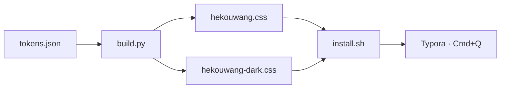
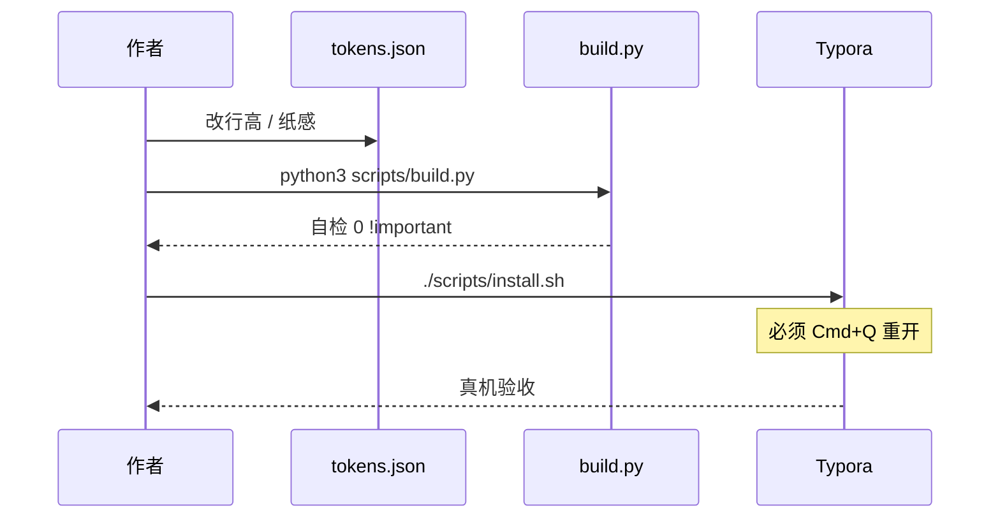
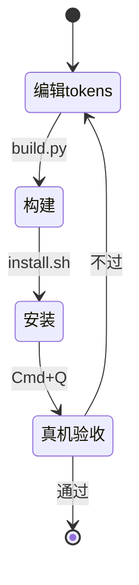

# hekouwang 主题验收样张

> ——用来验收排版，也适合直接截进 README（浅色 / 深色各一张）

这一份把 Typora 常渲染的块基本铺满。中英混排是重点：西文走 Anthropic Sans / Inter，中文 fallback 到苹方——**这不是妥协，桌面端本身就是这个机制**。我自己验收时会把本文件开着，浅深各盯三分钟。

**现行阅读指标（Hekouwang）**：正文 `1rem` · 行高 `1.65` · 行宽 `min(52em, 100%−gutter)` · `#write` 纸感卡片。

---

## 一、正文与中英混排

我写这段是为了看长段落的呼吸感。并排对照时，西文字形应接近 Anthropic Sans / Inter，中文走苹方；行距要像在读文章，不是在扫聊天气泡。

比如这句里混着 `variable font`、opsz 轴、以及 300→800 的字重范围，看看西文和苹方交接得顺不顺。数字也要对齐：2026 年、1,247 次、99.8% 的占比、测得 `font-size: 16px` 根字号。

行内样式一次过：**加粗看字重是不是真的**、*斜体/软强调*、~~删除线~~、`行内代码`、[一个链接](https://github.com/huiyonghkw/hekouwang-typora-theme)、以及 ==高亮==。

图注应是灰字小字、**没有**每字下方的着重号：

*(图：示例图注，不应出现橙点或疹子般着重号)*

### 三级标题：看字阶是否连贯

标题的负字距是高级感的主要来源，字号越大收得越多。h1 到 h4 应该形成清晰但不突兀的层级。

#### 四级标题

到这一级应该已经接近正文字号，靠字重和间距区分，而不是继续放大。

##### 五级标题

再下一档，仍靠字重，不靠装饰色。

###### 六级标题

最末级，字色可略软，别抢正文。

---

## 二、引用

> 引用块刻意没有用品牌色竖条，也不铺沉底。克制感来自低对比的墨色细线。
>
> 引用里也可以有 `代码` 和**加粗**。我自己写长文时，金句引用就靠这一条细线就够了。

> 嵌套引用：
> > 第二层应该继续保持缩进，但不叠加更重的视觉。
> >
> > > 第三层：再淡一点，别变成色块墙。

> 「如果你能找到 AI 真正『推动业务』的点，你就已经成功了一半。」

---

## 三、列表

无序列表：

- 第一项，看 marker 的颜色是不是够淡
- 第二项，带 `行内代码` 看行高有没有被撑开
- 第三项，带一点**加粗引导语**：后面跟说明文字
  - 嵌套一层
  - 再来一条，含 `npm run build`
    - 再深一层，看缩进节奏

有序列表：

1. 序号用等宽数字，多位数不会左右跳
2. 第二条看段距
3. 第三条
10. 第十条之后对齐仍然稳定
11. 第十一条

任务列表（不应出现逐条灰底卡片）：

- [x] 已完成项，勾选框是品牌橙填充，文字仅淡化、无删除线
- [x] 第二个已完成
- [ ] 未完成项，只有细边框
- [ ] 看勾选框和文字基线对不对齐
  - [x] 嵌套已完成
  - [ ] 嵌套未完成

---

## 四、代码

行内的 `npm install`、`--user-data-dir`、`font-optical-sizing: auto`。

下面几块故意挨着放，用来验收**连续 fence 的呼吸**（不该糊成灰条墙）。

```python
import re

def check(css: str) -> list[str]:
    """判据必须能分辨合法与违规，一刀切等于没有区分力。"""
    problems = []
    for m in re.finditer(r"([^{}]+)\{([^{}]*)\}", css):
        selector = m.group(1).strip().split("\n")[-1].strip()
        if selector == "html":
            continue  # 合法：根字号可用 px
        for fm in re.finditer(r"font-size:\s*[\d.]+px", m.group(2)):
            problems.append(f"{selector} 里 {fm.group(0)}")
    return problems


if __name__ == "__main__":
    print(check(open("theme/hekouwang.css").read()) or "ok")
```

```bash
# 注释色、字符串色、中文注释一起看
python3 scripts/build.py      # → hekouwang.css / hekouwang-dark.css
./scripts/install.sh          # 装进 Typora（Cmd+Q 再开）
```

```css
:root {
  --hk-ink: #141413;
  --hk-muted: #73726c;
  --hk-accent: #d97757;
}

#write {
  max-width: min(52em, calc(100% - 4rem));
  line-height: 1.65;
  /* 纸感画在 #write，content 只做 gutter */
}
```

```json
{
  "preset": "work",
  "type": {
    "body_size": "1rem",
    "body_lh": "1.65",
    "measure": "52em",
    "para_gap": "0.78rem"
  },
  "paper": { "enabled": true },
  "glyphs": { "anthropic_sans": 581, "cjk": 0 }
}
```

```javascript
// 语法高亮：关键字 / 字符串 / 数字 / 注释
const measure = "52em";
const leading = 1.65;
export function isLongForm(lh) {
  return lh >= 1.6; // 中文长文别低于这条线
}
```

```diff
--- a/scripts/tokens.json
+++ b/scripts/tokens.json
@@ -1,5 +1,5 @@
-  "measure": "42em",
+  "measure": "52em",
-  "body_lh": "1.42857",
+  "body_lh": "1.65",
```

单行短命令（看极短 fence 会不会显得空荡或过厚）：

```text
./scripts/install.sh && echo done
```

---

## 五、表格

宽表：看表头认度、单元格垂直呼吸、数字列对齐，以及**首列是否完整**（不贴纸边）。

| 字体 | 字符数 | CJK | 可变轴 | 授权 | 备注 |
|---|---:|:---:|---|---|---|
| Anthropic Sans | 581 | 0 | wght 300–800 / opsz | 专有 | `local()` 探测 |
| Anthropic Serif | 567 | 0 | wght 300–800 / opsz | 专有 | 不默认正文 |
| Inter | 2500+ | 0 | wght 100–900 | SIL OFL | 随包分发 |
| PingFang SC | — | 全 | 静态多字重 | 系统 | 中文主力 |

对比表（中文长单元格折行）：

| 阶段 | 目标 | 典型场景 | 关键行动 |
|---|---|---|---|
| 内部工具 | 低成本验证 | 周报、知识库、脚本装包 | 选一个真痛点，两周内上线 |
| 工作流嵌入 | 进日常路径 | 评审、客服草稿、数据清洗 | 接到现有工具链，不另起炉灶 |
| 产品能力 | 可对外交付 | Agent、检索增强、自动报表 | 定边界与评测，再谈规模化 |

表格要看三件事：表头分隔线（无厚灰条）、单元格呼吸、右对齐数字是否稳。

---

## 六、数学公式

行内：质能方程 $E = mc^2$，以及黄金分割 $\varphi = \dfrac{1+\sqrt{5}}{2}$。

块级：

$$
\begin{aligned}
\nabla \cdot \mathbf{E} &= \frac{\rho}{\varepsilon_0} \\
\nabla \cdot \mathbf{B} &= 0 \\
\nabla \times \mathbf{E} &= -\frac{\partial \mathbf{B}}{\partial t} \\
\nabla \times \mathbf{B} &= \mu_0\mathbf{J} + \mu_0\varepsilon_0\frac{\partial \mathbf{E}}{\partial t}
\end{aligned}
$$

矩阵：

$$
\mathbf{A} = \begin{pmatrix}
a_{11} & a_{12} & a_{13} \\
a_{21} & a_{22} & a_{23} \\
a_{31} & a_{32} & a_{33}
\end{pmatrix}
$$

---

## 七、图表（Mermaid）

流程图：



时序：



状态：



---

## 八、Callout / 提示块

> [!NOTE]
> GitHub 风格 callout：左边框定语义，底色应几乎看不见。适合放「补充说明」。

> [!TIP]
> 装完主题记得 **Cmd+Q**。只切换主题菜单不会重载已改过的 CSS——我踩过不止一次。

> [!IMPORTANT]
> 边框用墨色叠透明度，不要平铺 `#ccc`；暖底上的死灰线最毁气质。

> [!WARNING]
> 别手改 `theme/*.css`。下次 `build.py` 会覆盖。改 `scripts/tokens.json`。

> [!CAUTION]
> 深色侧栏比纸面更亮，是采样结论，不是 bug。靠「浅色取反」一定会做反。

---

## 九、分隔线与其他

上面是一条 HR。再来一条：

***

定义感内容（用列表模拟）：

**栏宽 measure**  
正文最大行宽上限；实际为 `min(52em, calc(100% − gutter))`，随窗伸缩。

**纸感 paper**  
画在 `#write` 上的径向暖白 + 圆角外阴影；侧栏 / gutter 是更深一档壳层。

**行内代码**  
暖褐字 + 极浅品牌橙底；一段里七八个也不该像疹子。

脚注示例[^1]，以及第二条[^2]。

[^1]: 脚注应比正文小一号、颜色更淡。
[^2]: 第二条脚注，看列表间距是否打架。

缩写与上标：HTML 里常见 `H~2~O` 与 `x^2^`（若开启对应扩展）。键盘感：<kbd>Cmd</kbd>+<kbd>Q</kbd>。

---

## 十、截图建议（给 README）

| 建议文件 | 窗口内容 | 主题 |
|---|---|---|
| `docs/screenshot-zh.png` | 本文件上半：标题 + 正文混排 | Hekouwang |
| `docs/screenshot.png` | 英文样张上半 | Hekouwang |
| `docs/screenshot-fences-zh.png` / `screenshot-fences.png` | 连续代码块 | Hekouwang |
| （待补）`docs/screenshot-dark.png` | 深色真窗 | Hekouwang Dark |

截图前：侧栏打开本仓库、选中 `demo/验收样张.md`，**Cmd+Q 重开后**再截，避免旧 CSS。

---

## 十一、验收清单

逐项打钩；有一项不过就改 `tokens.json` 重跑构建：

- [ ] 连读三段不累眼，行高和段距舒服
- [ ] 中英交界无基线错位、无字重突变
- [ ] 标题字阶连贯，h1→h6 层级清晰；开篇第一枚 h2 有呼吸
- [ ] 题头署名（本文件标题下的 byline）无左边线；正文引用有细线
- [ ] 加粗是真字重（边缘不虚）
- [ ] 任务列表无逐条灰卡片，完成态无删除线噪声
- [ ] 连续代码块有间距，不糊成灰墙；语法色不刺眼
- [ ] 表格首列完整、表头可辨、数字列稳定
- [ ] Mermaid / 公式可读，不炸版
- [ ] Callout 左边线清楚、底几乎看不见
- [ ] 侧栏、大纲、顶栏与正文同一套色温；壳层与纸面分层清楚
- [ ] 深色模式滚动条等原生控件跟 dark 一致
